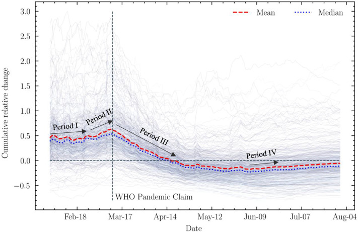

# Examining spatiotemporal changing patterns of bike-sharing usage during COVID-19 pandemic

#### Songhua Hua, Chenfeng Xiong, Zhanqin Liu, Lei Zhang
The COVID-19 pandemic has led to a globally unprecedented change in human mobility. 
Leveraging two-year bike-sharing trips from the largest bike-sharing program in Chicago, 
this study examines the spatiotemporal evolution of bike-sharing usage across the pandemic and compares it with other modes of transport. 
A set of generalized additive (mixed) models are fitted to identify relationships and delineate nonlinear temporal interactions between station-level daily bike-sharing usage and various independent variables 
including socio-demographics, land use, transportation features, station characteristics, and COVID-19 infections. 

## Data
* All_final_Divvy_R2019_1015.7z: features to build GAM

## Code
* [N]1-Trips_Data_Prepare.py: Finish the data preprocessing.
* [N]2.5-Mode compare.py: Compare three different modes: Driving; Transit; Bikesharing, and Total mobility
* [N]2-Feature_Engineering.py: Build features for GAMs.
* [N]3-Response_Engineering.py: Compute Y variables for GAMs
* [N]4-Model_Build.R: Finish the GAM model fit.
* [N]4.5-Single-Plot-GAM.R: Nonlinear interaction plot.
* [N]3.5-GeoPlot.py: Spatial plot.

## Results
#### Nonlinear interactions between time index and different independent variables of interest regarding the cumulative relative changes.

#### Spatial patterns of Cumulative relative changes by July 31st, 2020. 
